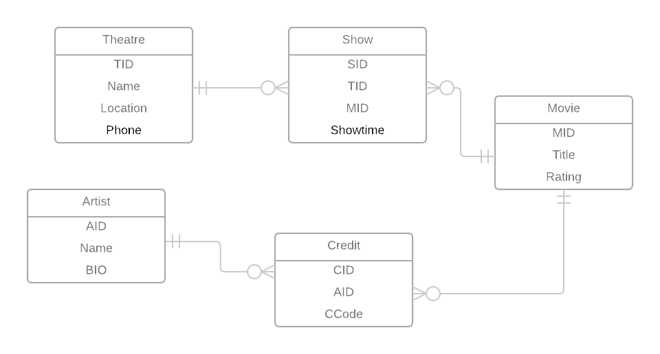

## Add a normalization Analysis

### 1NF Conversion
Single flaw is that there is no primary key for 1NF

USE `MOVIES_TONIGHT`;

CREATE TABLE IF NOT EXISTS `DATASHEET` (
  <u>`TName`</u> varchar(255) NOT NULL,
  `Location` varchar(255) NOT NULL,
  `Phone` varchar(12) NOT NULL,
  <u>`MTitle`</u> varchar(60) NOT NULL,
  <u>`ShowTime`</u> time NOT NULL,
  `Rating` varchar(5) NOT NULL,
  <u>`CCode`</u> char(1) NOT NULL,
  <u>`CName`</u> varchar(255) NOT NULL

### 2NF Conversion
TName-->Location,Phone
MTitle-->Rating

### 3NF Conversion
Theatres-->TName,Location,Phone
Movies-->MTitle,Rating
Credits-->MTitle,CCode,CName
Shows-->Tname,MTitle,ShowTime
Artists-->Name

Theatres-->TheatreID,TName,Location,Phone
Movies-->MovieID,MTitle,Rating
Credits-->MovieID,MTitle,CCode,ArtistID
Shows-->TheatreID,Tname,MTitle,ShowTime
Artists-->ArtistID,Name

Link the diagram here

